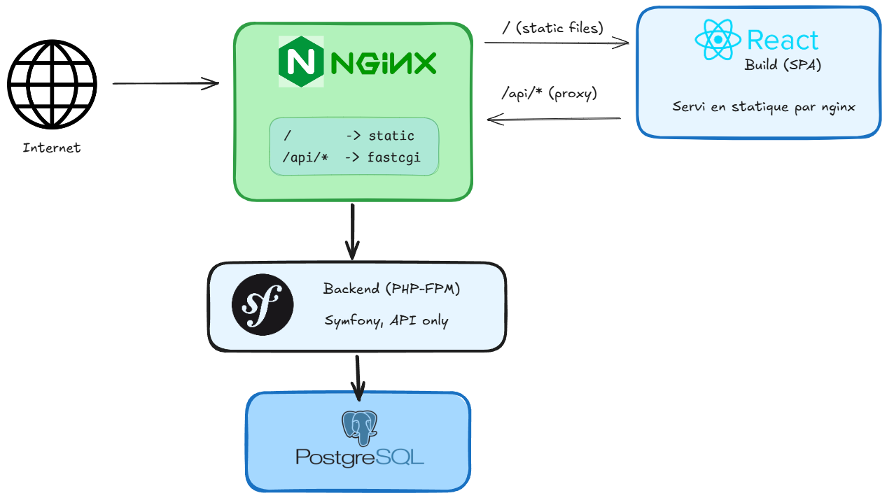

# SupportFlow — CI/CD & Kubernetes

Monorepo `backend` (Symfony 8.1 / PHP 8.4, API only) + `client` (React/Vite),
conteneurisé, avec pipeline CI/CD et déploiement Kubernetes.

## Architecture

```

```

- **CI** : job `test-backend` (PHPUnit contre une vraie base Postgres),
  job `test-client` (lint + build Vite).
- **CD** : build des images `supportflow-backend` (php-fpm) et
  `supportflow-nginx` (build Vite intégré + nginx), push sur GitHub Container
  Registry (`ghcr.io`).
- **Déploiement** : manifests Kubernetes (`k8s/`) testés sur un cluster local
  (`kind`), transposables tels quels sur AKS/EKS.

## Structure du repo

```
/
├── backend/                  ← code Symfony existant
│   └── Dockerfile
├── client/                   ← code React (Vite) existant
├── docker/
│   └── nginx/
│       ├── Dockerfile        ← build Vite + sert le résultat
│       └── default.conf
├── docker-compose.yml
├── .github/workflows/ci-cd.yml
└── k8s/
```

## Lancer en local (Docker Compose)

```bash
docker compose up --build
# app disponible sur http://localhost:8080
# les appels /api/* sont automatiquement routés vers Symfony
```

## Déployer sur Kubernetes (local, via kind)

```bash
kind create cluster --name supportflow

kubectl apply -f k8s/

kubectl port-forward svc/supportflow-nginx 8080:80
# app disponible sur http://localhost:8080
```

## Pistes d'amélioration (cloud réel)

- Provisionner le cluster (AKS/EKS) et le registre via Terraform (IaC).
- Ingress + cert-manager pour un vrai nom de domaine en HTTPS.
- Monitoring Prometheus/Grafana, logs centralisés.
- Helm chart pour paramétrer les déploiements par environnement (dev/staging/prod).